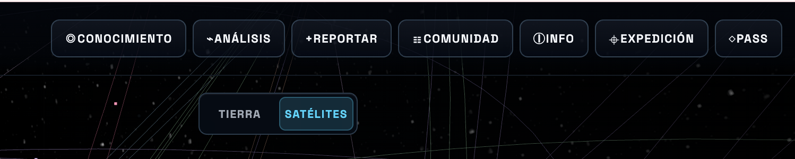

# Auditoría UX y producto: orden de la barra superior

Fecha: 2026-07-29  
Alcance: navegación superior de escritorio y correspondencia con el menú móvil.

## Evidencia

La barra presenta siete acciones con prácticamente el mismo peso visual:

1. Conocimiento
2. Análisis
3. Reportar
4. Comunidad
5. Info
6. Expedición
7. Pass

## Veredicto

Los destinos son útiles, pero el orden mezcla navegación, contribución, ayuda y
monetización en una única secuencia. El problema principal no es qué botón está
primero, sino que todos parecen pertenecer al mismo nivel de producto.

El orden recomendado para escritorio es:

**Análisis → Conocimiento → Comunidad | + Reportar | Expedición → Info | Pass**

Los separadores representan grupos visuales y semánticos, no necesariamente
líneas visibles.

## Razonamiento de producto

- **Análisis** es la continuación natural del atlas y de una selección activa.
  Debe ser el primer destino funcional.
- **Conocimiento** amplía el contexto después de observar o analizar.
- **Comunidad** ofrece una participación de bajo compromiso: leer, contrastar y
  debatir antes de aportar un caso propio.
- **Reportar** es una acción de creación, no una sección de navegación. Debe
  separarse y tener el tratamiento de CTA principal.
- **Expedición** es una herramienta de activación y descubrimiento. Conviene
  destacarla en primeras visitas y reducir su presencia después de completarla.
- **Info** es una utilidad de baja frecuencia y debe quedar al final del bloque
  de ayuda.
- **Pass** es una acción comercial. Su posición final es correcta, pero no debe
  competir visualmente con Reportar.

## Riesgos observados

1. **Jerarquía plana.** Siete botones equivalentes obligan a leer toda la fila.
2. **Dos CTA compiten.** Reportar y Pass persiguen objetivos diferentes, pero
   hoy se presentan como pares.
3. **Activación mezclada con navegación.** Expedición parece una sección
   permanente aunque su valor es principalmente introductorio.
4. **Orden móvil inconsistente.** El menú «Más» repite la secuencia anterior y
   no refleja la jerarquía propuesta.
5. **Semántica mejorable.** `.topbar-actions` es un contenedor genérico; debería
   ser una navegación etiquetada. Los símbolos decorativos deberían excluirse
   del nombre accesible.

## Aplicación responsive

- Escritorio amplio: mantener los siete destinos, agrupados y con Reportar como
  CTA principal.
- Tablet: conservar Análisis, Conocimiento, Comunidad y Reportar; mover
  Expedición, Info y Pass a «Más» si falta espacio.
- Móvil: mantener la barra inferior actual orientada a la tarea
  (Globo, Filtros, Tiempo, Datos, Más), pero reordenar «Más» como:
  Análisis, Conocimiento, Comunidad, Reportar, Expedición, Info, Pass, Ambiente.

## Validación recomendada

Instrumentar `top_nav_click`, aperturas y finalización de cada flujo. Comparar:

- tiempo hasta la primera acción significativa;
- uso de Análisis después de seleccionar un caso;
- apertura de Comunidad y continuidad hacia GitHub;
- inicio y finalización de Reportar;
- inicio y finalización de Expedición;
- apertura de Pass e intención registrada.

La recomendación es una hipótesis de arquitectura basada en el flujo actual. Sin
telemetría de uso no puede afirmarse todavía cuál es el orden óptimo por
frecuencia real.

## Límite de la auditoría

La captura permite evaluar jerarquía, agrupación y legibilidad. La estructura del
código confirma el orden de foco y los destinos de cada botón. No se ha medido
todavía el comportamiento con lector de pantalla ni se dispone de analítica de
uso real.
